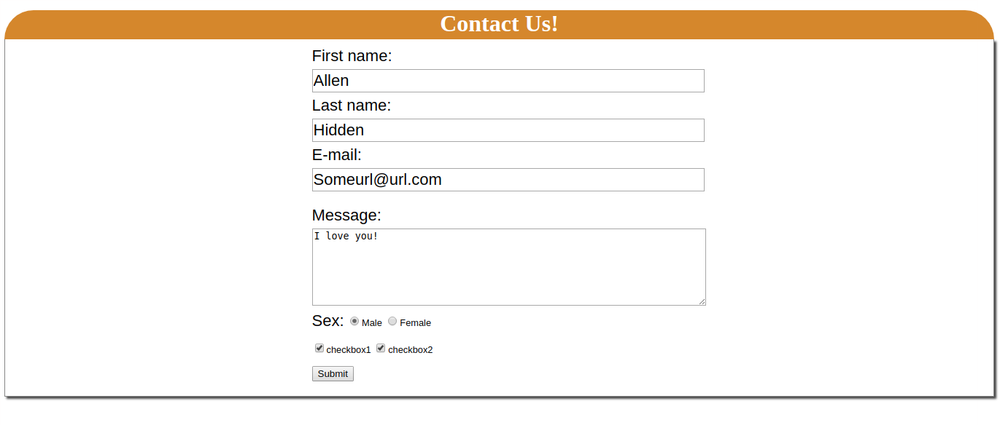

# Note:
## Simple Web Form 
> 1. simple HTML + CSS
> 2. learn what is **display:inline-block**
http://www.cnblogs.com/allen2333/p/8794143.html
> 3. 水平居中 - margin: 0 auto; margin只有两个元素，第一个位置代表top and bottom.第二个位置为left and right.
> 4. tag p is block, tag span is inline.
> 5. tag label and tag input.

Screenshot:

