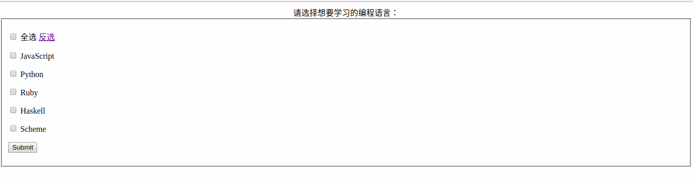

# Note:
## 实现全选和反选  
> 1. Based on jQuery API
> 2. http://www.cnblogs.com/allen2333/p/8989016.html 
> 3. 对表单绑定合适的事件处理函数。函数分为两部分，第一部分：打上全部的勾或者消除全部的勾；第二部分：用自定义change()切换显示的文字。（选了全选后，文字变为全不选）
> 4. 通俗来说，当选择“全选”或者“全不选”时，全部checkbox打上勾或取消勾，且用change()切换全选/全部选文字显示

Screenshot:

